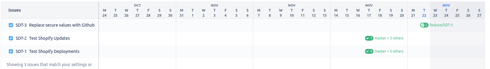
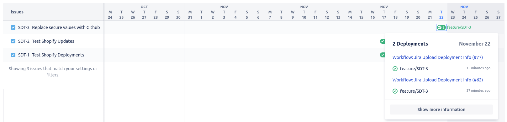
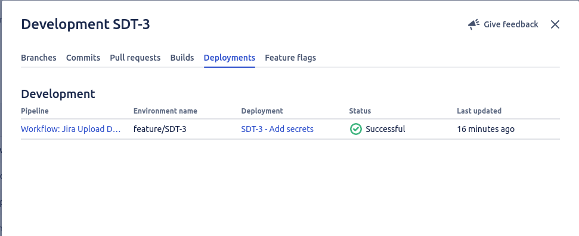

# Shopify Theme Deploy to JIRA GitHub Action

This GitHub workflow reports deployment information to JIRA cloud via the REST API.

### Implementation
To include this workflow in your repository, follow these steps:
1. Create the workflow file in your repository: `.github/workflows/shopify-theme-deploy-jira.yml`
```yaml
name: 'Jira Upload Deployment Info'
on:
  push:
    branches:
      - master
      - staging
      - release/*
      - feature/*
jobs:
  init-workflow:
    uses: acadaca-shopify/shopify-theme-deploy-jira/.github/workflows/shopify-theme-deploy-jira.yml@master
    secrets:
      JIRA_CLOUD_BASE_URL: ${{ secrets.JIRA_CLOUD_BASE_URL }}
      JIRA_CLIENT_ID: ${{ secrets.JIRA_CLIENT_ID }}
      JIRA_CLIENT_SECRET: ${{ secrets.JIRA_CLIENT_SECRET }}
```

2. Add the secrets to the repository under<br/> `Settings -> Security -> Secrets -> Actions` <br/><br/>For Acadaca Users, you can find these values in LastPass under `Shopify JIRA Client Credentials` in the `Shared-Shopify` folder<br/><br/>
3. Push/Merge the changes to each branch up the chain `(Feature -> Release -> Staging -> Master)`

### Usage

Once installed, this GitHub Action will run each time a commit or Pull Request is pushed/merged to the branches listed above.
Information about the push/merge and environment will be reported to JIRA under the `Deployments` tab.

** Please note, only commits appropriately tagged with JIRA issue keys will be included in deployment information
Example: `JIRA-123 - Some commit message`




